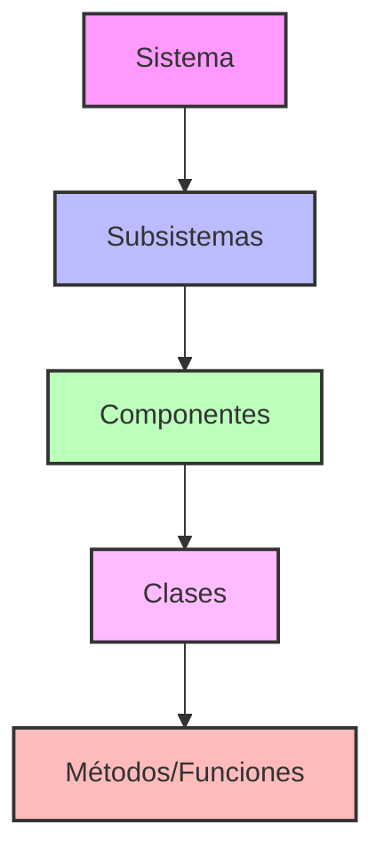
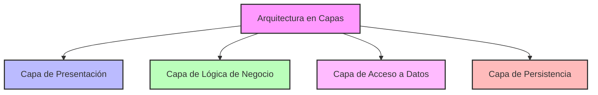
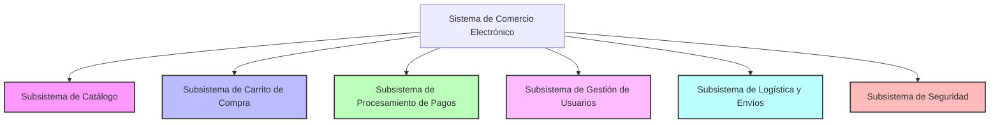
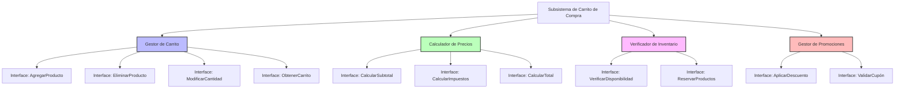
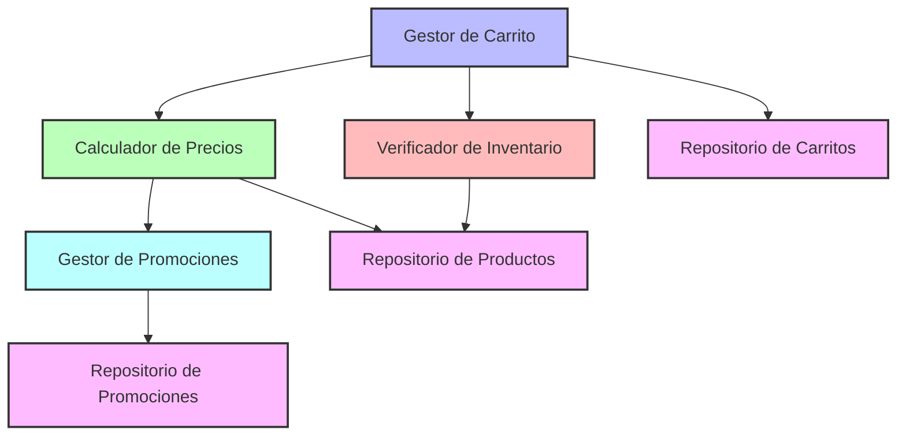
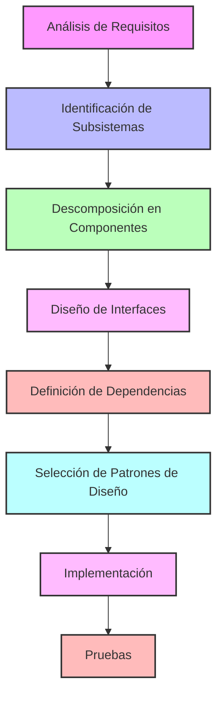

# Guía Completa de Descomposición de Sistemas

## 1. Fundamentos del Diseño de Software

### 1.1 Objetivos del Diseño de Software
- **Calidad**: Cumplimiento de requisitos funcionales y no funcionales
- **Mantenibilidad**: Facilidad para evolucionar y modificar el sistema
- **Escalabilidad**: Capacidad de crecimiento sin degradación del rendimiento
- **Reutilización**: Posibilidad de usar componentes en diferentes contextos
- **Extensibilidad**: Facilidad para añadir nuevas características
- **Robustez**: Comportamiento correcto en condiciones adversas
- **Eficiencia**: Optimización del uso de recursos computacionales

### 1.2 Principios Fundamentales

#### Principios SOLID
- **S - Responsabilidad Única**: Una clase debe tener una y solo una razón para cambiar
- **O - Abierto/Cerrado**: Las entidades deben estar abiertas para extensión pero cerradas para modificación
- **L - Sustitución de Liskov**: Los objetos de una superclase deben poder ser reemplazados por objetos de sus subclases sin afectar la funcionalidad
- **I - Segregación de Interfaces**: Ningún cliente debe ser forzado a depender de interfaces que no utiliza
- **D - Inversión de Dependencias**: Los módulos de alto nivel no deben depender de módulos de bajo nivel; ambos deben depender de abstracciones

#### Otros Principios Importantes
- **DRY** (Don't Repeat Yourself): Evitar la duplicación de código y conocimiento
- **KISS** (Keep It Simple, Stupid): Mantener las soluciones simples
- **YAGNI** (You Aren't Gonna Need It): No implementar funcionalidades hasta que sean necesarias
- **Ley de Demeter**: Un objeto debe tener conocimiento limitado sobre otros objetos
- **Alta cohesión, bajo acoplamiento**: Mantener relacionadas las responsabilidades internas y minimizar dependencias externas

## 2. Proceso de Descomposición de Sistemas

### 2.1 Conceptos Fundamentales de la Descomposición
- **Modularidad**: División en módulos con responsabilidades específicas
- **Abstracción**: Ocultar detalles de implementación bajo interfaces simples
- **Encapsulación**: Agrupar datos y comportamientos relacionados
- **Separación de preocupaciones**: Dividir el sistema según diferentes aspectos o responsabilidades

### 2.2 Niveles de Descomposición



#### 2.2.1 Paquetes
- **Organización**: Agrupan elementos relacionados lógicamente
- **Encapsulación**: Controlan la visibilidad y el acceso
- **Gestión de dependencias**: Facilitan el manejo de dependencias entre elementos
- **Reutilización**: Permiten la reutilización de funcionalidades completas

#### 2.2.2 Subsistemas
- Un subsistema es una agrupación de elementos de diseño que proporciona servicios relacionados a través de interfaces definidas
- Mayor nivel de abstracción que los paquetes
- Proporciona servicios coherentes y relacionados
- Se comunica con otros subsistemas a través de interfaces bien definidas
- Puede implementarse como un conjunto de paquetes

#### 2.2.3 Componentes
- Un componente es una unidad de software con funcionalidad bien definida, reemplazable y reutilizable
- **Encapsulación**: Oculta los detalles de implementación
- **Interfaces explícitas**: Define claramente cómo interactuar
- **Independencia**: Minimiza dependencias externas
- **Sustitución**: Puede ser reemplazado por otro componente compatible

## 3. Patrones Arquitectónicos

Los patrones arquitectónicos son soluciones probadas para problemas comunes de diseño a nivel de sistema:

- **MVC (Modelo-Vista-Controlador)**: Separa la lógica de negocio, la presentación y el control
- **Arquitectura en capas**: Organiza el sistema en capas con responsabilidades específicas
- **Cliente-Servidor**: Divide la funcionalidad entre proveedores de servicios y consumidores
- **Microservicios**: Descompone el sistema en servicios pequeños e independientes
- **Arquitectura basada en eventos**: Organiza el sistema alrededor de la producción y consumo de eventos



## 4. Proceso para Identificar Subsistemas y Componentes

### 4.1 Pasos para la Identificación de Subsistemas

1. **Análisis de Requisitos**:
   - Identificar las principales funcionalidades y responsabilidades del sistema
   - Agrupar requisitos relacionados

2. **Identificación de Dominios**:
   - Reconocer áreas funcionales distintas
   - Identificar límites naturales entre diferentes aspectos del sistema

3. **Aplicación del Principio de Responsabilidad Única**:
   - Cada subsistema debe tener una única razón para cambiar
   - Debe agrupar funcionalidades cohesivas

4. **Definición de Interfaces**:
   - Determinar cómo interactuarán los subsistemas
   - Definir contratos claros entre subsistemas

### 4.2 Pasos para la Descomposición en Componentes

1. **Análisis de Responsabilidades del Subsistema**:
   - Identificar todas las responsabilidades del subsistema
   - Aplicar el principio de responsabilidad única a nivel más granular

2. **Identificación de Componentes Candidatos**:
   - Agrupar funcionalidades relacionadas
   - Buscar oportunidades de reutilización

3. **Diseño de Interfaces de Componentes**:
   - Definir métodos y servicios expuestos
   - Aplicar el principio de segregación de interfaces

4. **Análisis de Dependencias**:
   - Identificar cómo se relacionan los componentes
   - Aplicar el principio de inversión de dependencias

## 5. Ejemplos Prácticos

### 5.1 Ejemplo 1: Sistema de Comercio Electrónico

#### Subsistemas Identificados:



#### Descomposición del Subsistema de Carrito de Compra:



#### Ejemplo de Interfaces para el Gestor de Carrito:

```java
// Ejemplo de interfaz para el componente Gestor de Carrito
public interface GestorCarritoService {
    /**
     * Agrega un producto al carrito de compras del usuario
     * @param usuarioId Identificador del usuario
     * @param productoId Identificador del producto
     * @param cantidad Cantidad del producto a agregar
     * @return El carrito actualizado
     * @throws ProductoNoEncontradoException Si el producto no existe
     * @throws InventarioInsuficienteException Si no hay suficiente inventario
     */
    CarritoDTO agregarProducto(String usuarioId, String productoId, int cantidad) 
        throws ProductoNoEncontradoException, InventarioInsuficienteException;
    
    /**
     * Elimina un producto del carrito de compras
     * @param usuarioId Identificador del usuario
     * @param productoId Identificador del producto
     * @return El carrito actualizado
     * @throws ProductoNoEnCarritoException Si el producto no está en el carrito
     */
    CarritoDTO eliminarProducto(String usuarioId, String productoId) 
        throws ProductoNoEnCarritoException;
    
    /**
     * Modifica la cantidad de un producto en el carrito
     * @param usuarioId Identificador del usuario
     * @param productoId Identificador del producto
     * @param nuevaCantidad Nueva cantidad del producto
     * @return El carrito actualizado
     * @throws ProductoNoEnCarritoException Si el producto no está en el carrito
     * @throws InventarioInsuficienteException Si no hay suficiente inventario
     */
    CarritoDTO modificarCantidad(String usuarioId, String productoId, int nuevaCantidad) 
        throws ProductoNoEnCarritoException, InventarioInsuficienteException;
    
    /**
     * Obtiene el carrito de compras actual del usuario
     * @param usuarioId Identificador del usuario
     * @return El carrito del usuario
     * @throws UsuarioNoEncontradoException Si el usuario no existe
     */
    CarritoDTO obtenerCarrito(String usuarioId) throws UsuarioNoEncontradoException;
}
```

#### Dependencias entre Componentes:



## 6. De la Teoría a la Implementación

### 6.1 Proceso Completo



### 6.2 Aplicación de Principios SOLID en la Implementación

1. **Principio de Responsabilidad Única (SRP)**:
   - Implementar clases con una única responsabilidad
   - Ejemplo: Una clase `GestorCarrito` que solo maneja operaciones del carrito, no cálculos de precios o verificación de inventario

2. **Principio Abierto/Cerrado (OCP)**:
   - Implementar funcionalidades mediante abstracciones extensibles
   - Ejemplo: Una interface `CalculadorPrecios` que permite múltiples implementaciones sin modificar el código existente

3. **Principio de Sustitución de Liskov (LSP)**:
   - Diseñar jerarquías de clases que permitan la sustitución
   - Ejemplo: Diferentes implementaciones de `VerificadorInventario` para distintos tipos de productos

4. **Principio de Segregación de Interfaces (ISP)**:
   - Crear interfaces pequeñas y específicas
   - Ejemplo: Separar `GestionCarritoService` de `CalculadorPreciosService`

5. **Principio de Inversión de Dependencias (DIP)**:
   - Depender de abstracciones, no de implementaciones concretas
   - Ejemplo: `GestorCarritoImpl` depende de la interface `RepositorioCarritos`, no de una implementación específica
  
[Principios SOLID: Guía Práctica con Ejemplos de Código](https://github.com/carlos-saldarriaga/ADS/blob/main/SOLID.md)


### 6.3 Artefactos del Diseño

Durante el proceso de diseño, se crean diversos artefactos que documentan y comunican las decisiones:

- **Diagramas de arquitectura**: Visión general de la estructura del sistema
- **Diagramas UML**:
  - Diagramas de clases
  - Diagramas de secuencia
  - Diagramas de componentes
  - Diagramas de despliegue
- **Documentos de diseño**: Descripciones detalladas de las decisiones
- **Prototipos**: Implementaciones parciales para validar decisiones
- **Patrones de diseño documentados**: Soluciones probadas a problemas comunes

## 7. Recomendaciones para el Taller

### 7.1 Enfoque Metodológico

1. **Análisis de la Historia**: Identificar actores, procesos, requisitos funcionales y no funcionales
2. **Identificación de Subsistemas**: Aplicar el Principio de Responsabilidad Única a nivel macro
3. **Descomposición en Componentes**: Refinar la descomposición aplicando SOLID
4. **Diseño de Interfaces**: Definir contratos claros entre componentes
5. **Análisis de Dependencias**: Identificar relaciones aplicando el Principio de Inversión de Dependencias

### 7.2 Consejos Prácticos

- Comenzar por identificar las grandes áreas funcionales
- Enfocarse en las interfaces antes que en la implementación
- Mantener la cohesión alta y el acoplamiento bajo
- Evaluar continuamente las decisiones contra los principios SOLID
- Documentar las razones detrás de las decisiones de diseño
- Iterar y refinar el diseño según sea necesario

## 8. Conclusiones

Un buen diseño de software equilibra múltiples factores como rendimiento, mantenibilidad, extensibilidad y seguridad. La descomposición efectiva de sistemas en subsistemas y componentes bien definidos es fundamental para gestionar la complejidad y construir software de calidad.

El diseño de software es tanto una ciencia como un arte, que requiere experiencia, conocimiento y creatividad para resolver problemas complejos de manera efectiva.
